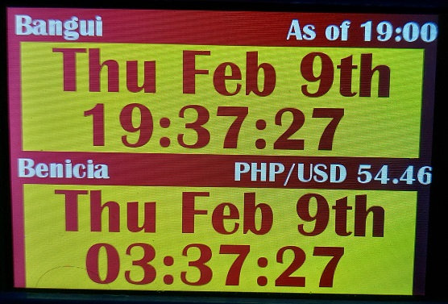
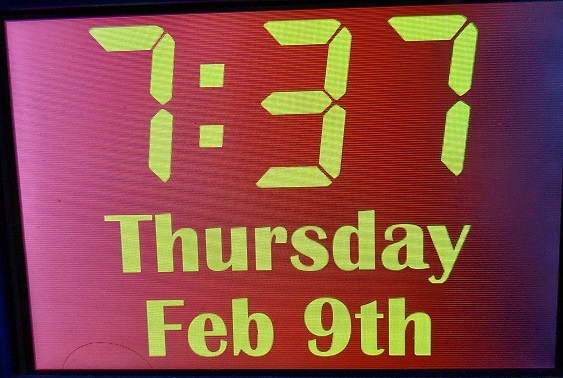
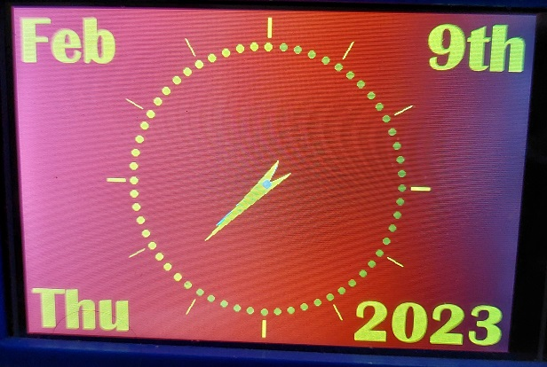
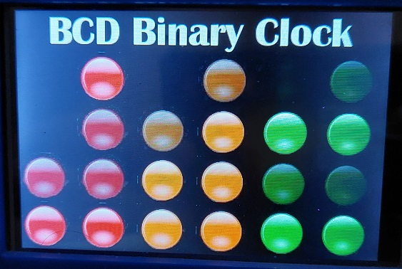
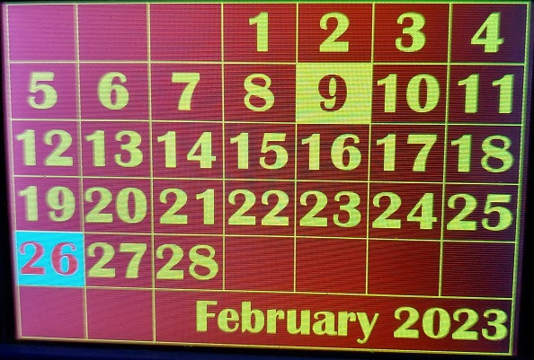
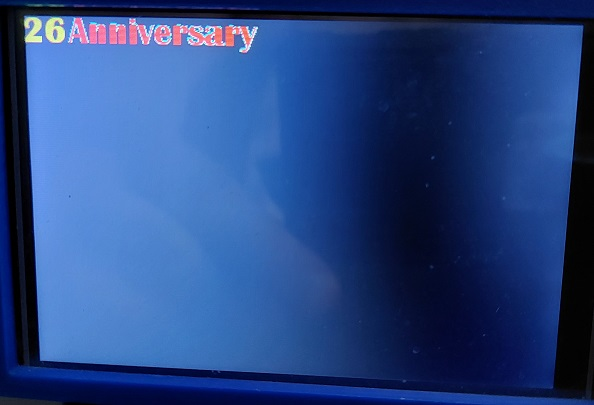
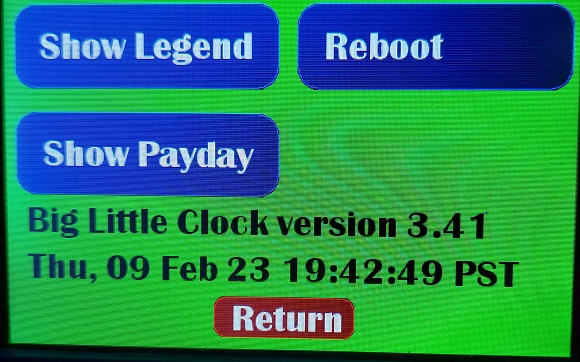
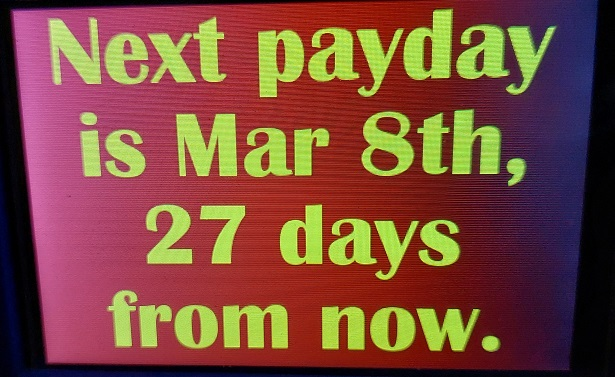

# ILI9486_v3.42_Little_Clock_Touch

Clock with multiple times zones, multiple clock faces, calendar, touch capable and much more.  See the jpgs in the folder for a view of the screens.

Included is a routine I wrote to implement single, double, triple, long touch and 8-way swipe.  It can be used for any touch screen but may, of course, take some modification.

A single touch rotates between the 5 main screens.  A double tap brings up the calendar.  Today is highlighted as well as any user supplied dates, such as anniversary or birthdays.  A swipe brings up the American Social Security payday.  You enter your birth date (numberic day of monty) and it figures out when your payday is.

When on the calendar screen, a left or right swipe will change the month up or down by one month.  There is no provision for changing year of more than one month at a time.

On any clock screen, a long press brings up a buttons screen that is where you can request Legends (user supplied highlighted days textual reminders) for the month, a second way to see the SS payday and a Reboot button.  Sometimes, it gets the wrong time and I have to reboot to get it right.  Easier and better than power cycling.  I use ezTime and it sometimes fails to get the right time(s).  It is so easy to use, otherwise, that I keep it.

This program has mostly been converted to use OpenFontRender and uses TTF binaries and sets font selection and sizes as needed.  I have not figured out how to interface with the tft_espi button render routine to make it connect with the OFR code so there is still some old binary lines to support that.  Will remove when I can.

This one enables you to have two time zones showing at the same time.  
Neither of them needs to be the time shown on all of the other screens (hometime).

This screen was designed to be readable from across a large room but still usable in smaller spaces, too.

This one is for fun.  The seconds come on and off around the screen and the hands, of course, point to the hour and minute.

This one is for fun, too.  Ask your friends to tell you the time as it is shown on the "LED" dots.  
I won't spoil the fun by telling how just yet. Watch if for a while and figure out how to read it.

This is the calendar display.  It comes up on the current month and the current day highlighted.
A swipe left or right will change it, one month at a time, forward or back.

This is the text associated with a date that is highlighted on the calendar screen other than the current day.

This screen has 3 buttons on it for Show Legend, Show Payday (duplicate of a swipe on a clock screen) 
and the option to reboot in case the fetched time is incorrect.

This one shows the payday for USA Social Security System.  
It depends on your birth day (just the date of the month, not your full birthdate)

